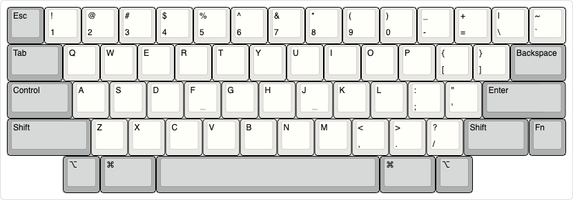
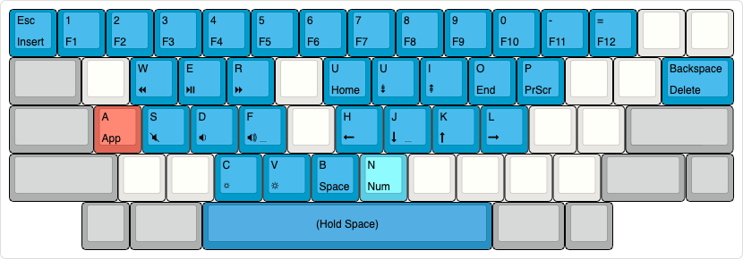
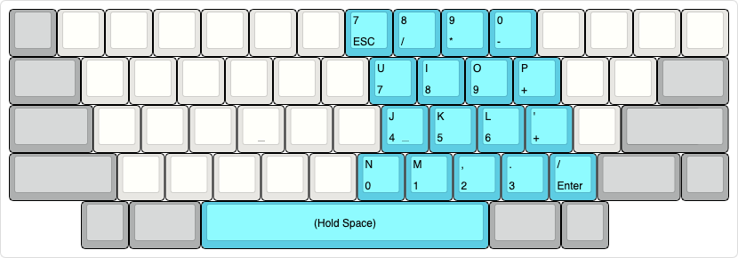
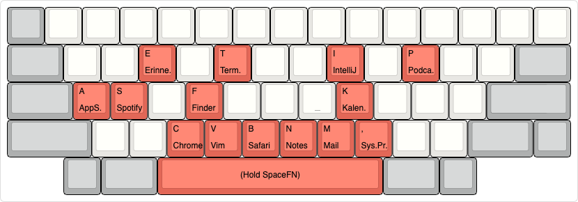
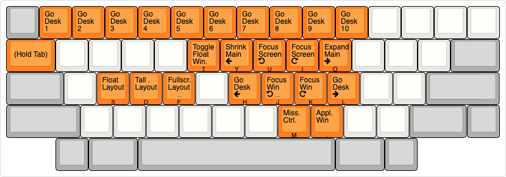
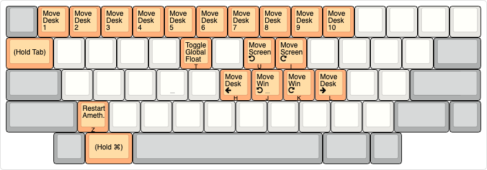

# hhkb-karabiner-keymap

Keyboard re-mappings for the **Happy Hacking Keyboard** in MacOS.

Mappings are done with [Karabiner-Elements](https://github.com/pqrs-org/Karabiner-Elements) and include the following layers:
* **Hyper:** Holding down Tab triggers Control+Option+Shift. This is used to setup [Amethyst](https://github.com/ianyh/Amethyst) and Mission Control shortcuts.
* **SpaceFN:** Holding down the space bar triggers a function layer to handle arrow and special keys. Inspired by [spiceBar](https://geekhack.org/index.php?topic=51069.0).

Keyboard layout pictures are created with [keyboard-layout-editor](http://www.keyboard-layout-editor.com).

## Basic layout

## SpaceFN

### Base

### Numpad

### Applications

## Hyper

### Base

### With Command

